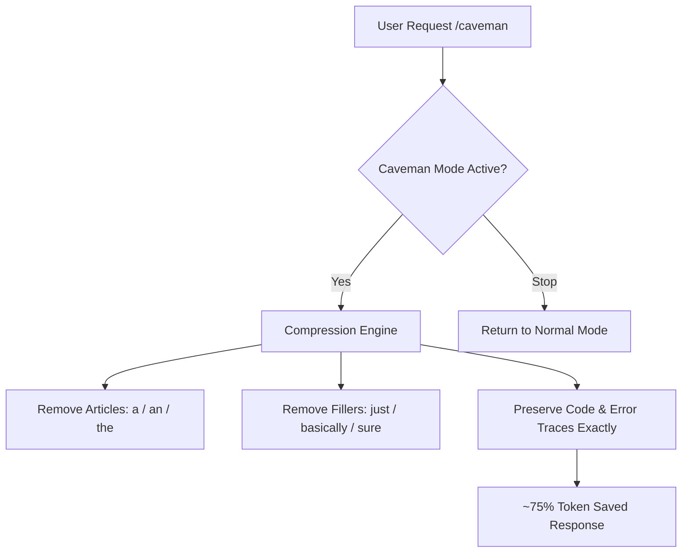

# caveman

Cuts response token usage ~75% by dropping filler words, articles, and pleasantries while keeping all technical accuracy.

## What it does

Enables ultra-compressed communication mode. Removes articles (a/an/the), filler words (just/really/basically), pleasantries (sure/certainly/of course), and hedging. Stays active every response until you say "stop caveman" or "normal mode". All technical terms, error quotes, and code blocks stay exact.

## Visual Flow



## Example

**You type:**
```
/caveman
Why React component re-render?
```

**What happens:**
The skill activates. From this point forward, responses use the caveman style:

```
Inline obj prop → new ref → re-render. Use useMemo.
```

Instead of the normal style:

```
Sure! I'd be happy to help. When you pass an inline object as a prop, React creates a new reference each render, which triggers a re-render of any child component that depends on that prop. The solution is to use useMemo to memoize the object...
```

The style stays active for every response until you type "stop caveman" or "normal mode".

## Setup

Nothing to set up.

## Install

```bash
cp -r caveman ~/.claude/skills/
```
