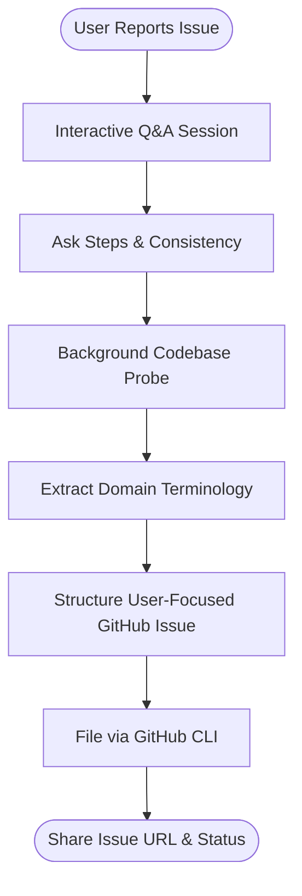

# qa

Interactive QA session where you describe bugs conversationally and the skill files GitHub issues.

## What it does

You report problems you found in the app. The skill listens, asks 2-3 clarifying questions (what you expected vs what happened, steps to reproduce, consistency). Then explores the codebase in the background to learn domain language and context. Decides whether to file one issue or break it into multiple independent issues. Files durable, user-focused GitHub issues using the project's vocabulary. Shares issue URLs back to you.

## Visual QA Workflow



## Example

**You type:**
```
/qa
I found a bug — when I upload a receipt, the due date shows today even though I set it to 30 days out.
```

**What happens:**

1. Skill asks: "Is this consistent every time?" and "Does it happen in all browsers or just one?"
2. Meanwhile, background agent explores the codebase to understand receipt schema and date handling.
3. Skill files a GitHub issue:
   ```
   ## What happened
   Receipt due date shows as today's date regardless of the value set during upload.

   ## What I expected
   Due date should reflect the value entered in the form (e.g. 30 days from today).

   ## Steps to reproduce
   1. Upload a new receipt
   2. Set due date to 30 days from today
   3. Confirm upload
   4. View the receipt — due date shows today

   ## Additional context
   This is consistent on each upload across all browsers.
   ```
4. Shares the issue URL. Asks "Next issue, or are we done?"

## Setup

Requires GitHub CLI (`gh`) to file issues. Assumes you are already authenticated to the repo.

## Install

```bash
cp -r qa ~/.claude/skills/
```
