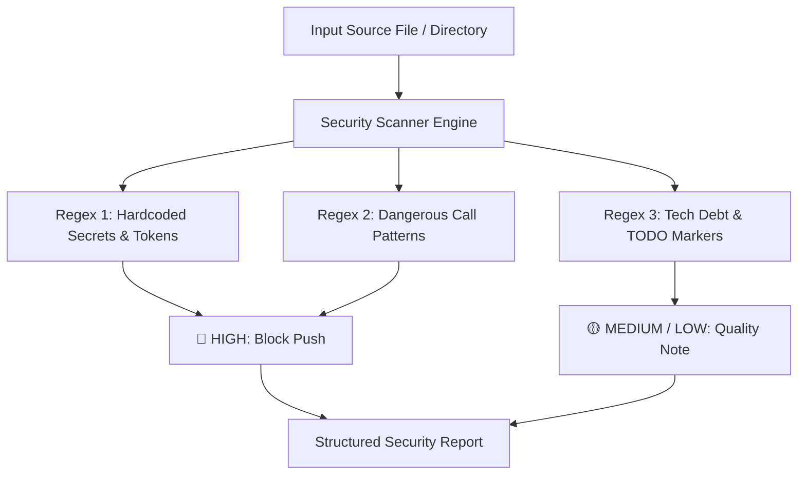

# security-check

Scans a file or directory for hardcoded secrets, dangerous code patterns, and tech debt markers.

## What it does

Runs a pure-regex scanner (no network, no LLM) that finds hardcoded API keys, passwords, shell=True in subprocess calls, os.system() usage, TODO/FIXME markers, insecure HTTP URLs, and debug prints. Reports severity levels (HIGH = secrets/dangerous patterns, MEDIUM = code quality issues, LOW = style notes). No dependencies beyond Python standard library.

## Visual Scanner Architecture



## Example

**You type:**
```
/security-check canary.py
```

**What happens:**

```
🔍 Security scan: canary.py
  🔴 L2: [hardcoded_token] Hardcoded secret value
     api_key = "sk_live_abcd1234efgh5678"
  🟡 L3: [os_system] os.system() — prefer subprocess
     os.system("ls")
  🟡 L4: [todo_hack] Tech debt marker
     # TODO: fix this
```

HIGH findings must be fixed before push. MEDIUM/LOW findings are noted but not blocking. Scanner makes no network calls unless optional Telegram env vars are set (entirely opt-in).

## Setup

Nothing to set up. Requires only Python 3.6+ and the standard library. Makes no network calls unless both `SECURITY_SCAN_TELEGRAM_TOKEN` and `SECURITY_SCAN_TELEGRAM_CHAT` environment variables are set (purely optional).

## Install

```bash
cp -r security-check ~/.claude/skills/
```
