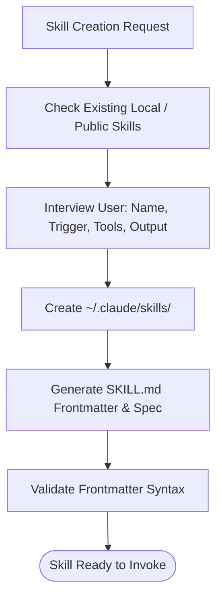

# skill-creator

Scaffolds new Claude skills with proper structure in `~/.claude/skills/`.

## What it does

Creates a new skill folder with a SKILL.md file. First checks whether an existing skill should be extended instead of creating a sibling. Asks you for the skill name, one-sentence description, trigger phrases, required tools/APIs, and expected output. Then writes the skill folder, SKILL.md template, and confirms the skill is ready to invoke.

## Visual Creation Pipeline



## Example

**You type:**
```
/skill-creator
I want a new skill to check the weather.
```

**What happens:**

1. Checks if a weather-related skill already exists locally or publicly (`npx skills find`).
2. Asks:
   - Command name? `/weather`
   - What does it do? "Fetch today's forecast for a given location"
   - Trigger phrases? "weather", "forecast", "check the weather"
   - What tools/APIs? "OpenWeather API"
   - Expected output? "Text summary of temperature, conditions, wind"
3. Creates `~/.claude/skills/weather/` with SKILL.md template.
4. Confirms: "Skill `/weather` created. Invoke with `/weather` in your next session."

## Setup

Nothing to set up.

## Install

```bash
cp -r skill-creator ~/.claude/skills/
```
