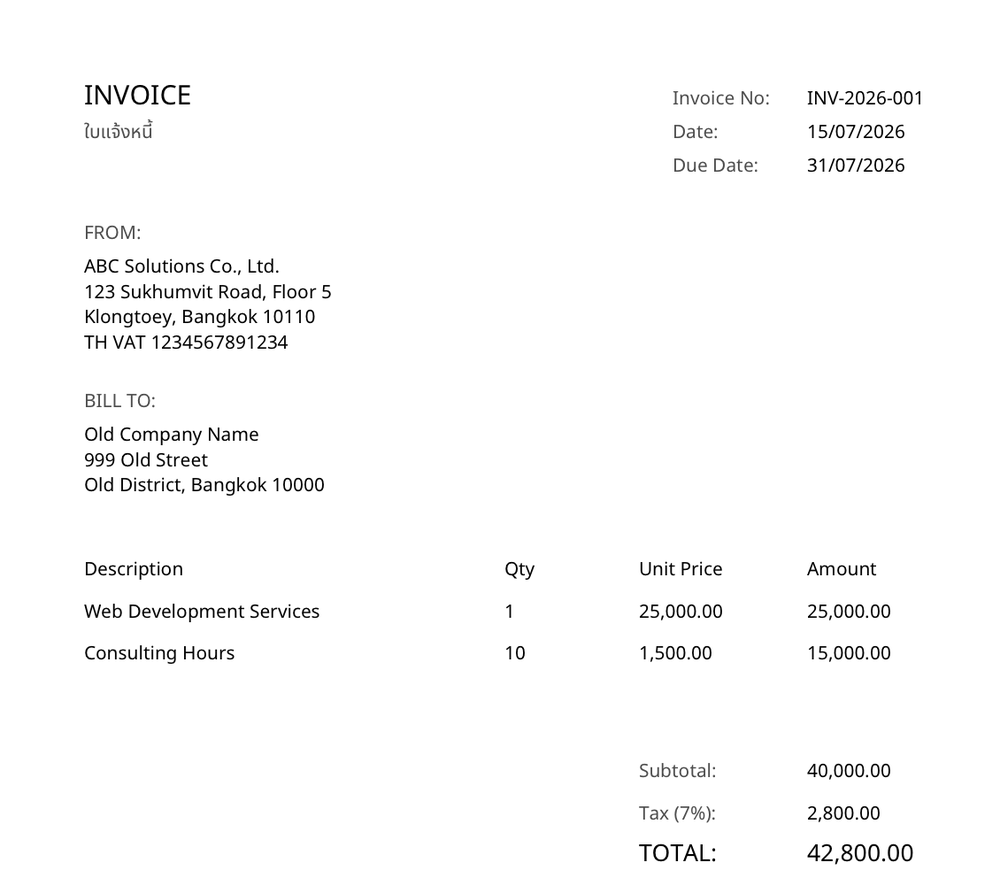
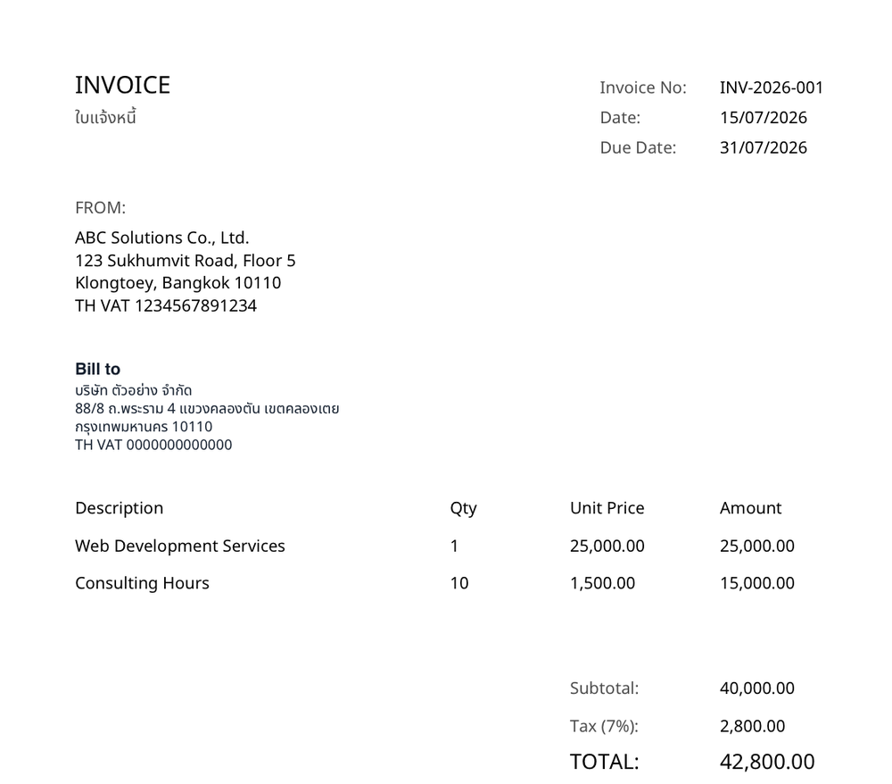

> **Disclaimer:** This project is created for educational purposes only. We do not engage in any illegal process or infringe on any third-party rights.

---

# fixbill CLI

Fix Thai and English PDF invoices — update addresses, dates, invoice numbers, titles, logos, and issuer info. Always saves locally; syncs to Google Drive automatically when run through Claude Code or Codex.

---

## See it work

Rewrite the Bill-to block with a single command:

```bash
fixbill invoice.pdf $'บริษัท ตัวอย่าง จำกัด\n88/8 ถ.พระราม 4 แขวงคลองตัน เขตคลองเตย\nกรุงเทพมหานคร 10110\nTH VAT 0000000000000'
```

One command rewrites the Bill-to block: the old address is masked out and the new one redrawn with a Thai-capable font, so lines wrap on words instead of mid-character.

| Before | After |
|--------|-------|
|  |  |

---

## Requirements

- Node.js 18+
- Git
- macOS / Linux / Windows 10+ (native — no WSL needed)

---

## Installation

### macOS / Linux

```bash
git clone https://github.com/iampon-p/fixbill-cli.git ~/fixbill-cli
cd ~/fixbill-cli
sudo npm run setup
```

> **Recommended:** clone to `~/fixbill-cli` (home directory). Cloning elsewhere works too, but if you ever **move the folder** after setup, run `sudo npm link` from the new location to re-register the `fixbill` command — see Troubleshooting below.

### Windows

Open **Command Prompt** or **PowerShell** (no need to run as Administrator):

```bat
git clone https://github.com/iampon-p/fixbill-cli.git %USERPROFILE%\fixbill-cli
cd %USERPROFILE%\fixbill-cli
npm run setup
```

In PowerShell, use `$env:USERPROFILE\fixbill-cli` instead of `%USERPROFILE%\fixbill-cli`

> **Windows notes:**
> - No `sudo` needed — `npm link` on Windows installs directly to the user profile.
> - Setup automatically installs the Claude Code skill (`/fixbill`) at `%USERPROFILE%\.claude\skills\fixbill\` — open Claude Code again after setup completes.
> - Run `fixbill doctor` to verify that the CLI, server dependencies, and Claude skill are ready.
> - If cloned before (`destination path 'fixbill-cli' already exists`), enter the existing folder and run `git pull origin main && npm run setup` instead.
> - If you get the error `running scripts is disabled on this system` when typing `npm` or `fixbill` in PowerShell, see Troubleshooting below (fix once with `Set-ExecutionPolicy`).

### After setup

No Google login step needed — the CLI itself never touches Google Drive. Drive save happens
inside Claude Code / Codex via their own Google Drive connector (see
[Google Drive Sync](#google-drive-sync) below), using whichever Google account that session is
already connected to.

Verify the install:

```bash
fixbill help          # CLI works from any folder in the terminal
fixbill doctor        # Check CLI + server deps + Claude skill
```

Open Claude Code and type `/fixbill` — if the slash command appears, the skill installed successfully.

If `/fixbill` does not appear, run `npm run install-skill` from the fixbill-cli folder and open Claude Code again.

---

## Commands

### General

```
fixbill help
    Show all commands

fixbill update
    Update fixbill to the latest version
```

### Address fix

```
fixbill <file> "<address>"
    Update the customer address (Bill-to block)
    Example: fixbill bill.pdf "Company ABC Ltd\nBangkok 10000"
    Note: Drive sync happens only when run via Claude/Codex — running directly in the terminal saves locally only.
```

### Date fix

```
fixbill <file> "<DD/MM/YYYY>"
    Update the invoice date (replaces only the date in the document header at top-left or top-right)
```

### Title

```
fixbill <file> --title "<text>"
    Change the document title (e.g., Invoice, Receipt, Tax Invoice)
    Font is automatically made bold and larger than normal text
```

### Invoice, Receipt & Due Dates

*Note: These commands work only if the document contains the labels "เลขที่", "Invoice", "Receipt", "Due Date", or "Date paid"*

```
fixbill <file> --invoice "<text>"
    Update the invoice number

fixbill <file> --receipt "<text>"
    Update the receipt number

fixbill <file> --due "<text>"
    Update the due date

fixbill <file> --date-paid "<text>"
    Update the date paid
```

### Logo

```
fixbill <file> --logo <image-path>
    Replace the company logo at top-right (supports PNG and JPEG)
    Example: fixbill invoice.pdf --logo logo.png
```

---

## Combine flags

You can specify multiple fields to edit at once:

```bash
# Change title + invoice number + due date
fixbill invoice.pdf --title "ใบแจ้งหนี้" --invoice "INV-001" --due "30/05/2026"

# Change invoice date + receipt number + logo
fixbill receipt.pdf "21/05/2026" --receipt "REC-001" --logo "logo.png"
```

> **Terminal notes:**
> If the address text you want to insert has **spaces** or **line breaks**, you **must** wrap it in quotes `" "` (e.g., `"Company A Ltd"`). Without quotes, the terminal treats each word as a separate command and errors.
>
> PDF paths with spaces work if the file exists — e.g., `fixbill /Users/me/Downloads/my invoice.pdf "tester"` automatically recombines the path into a single file.
>
> Windows supports both PowerShell/CMD paths like `C:\Users\<your-user>\Downloads\my invoice.pdf` and Git Bash paths like `/c/Users/<your-user>/Downloads/my invoice.pdf` if the file exists.
>
> The terminal prints the address exactly as you send it and does not guess the layout. To break lines nicely, insert `\n` yourself:
>
> ```bash
> fixbill receipt.pdf $'Company A Ltd\n123 Sukhumvit Rd\nBangkok 10110\nTH VAT 0000000000000'
> ```
>
> When using Claude/Codex via `/fixbill`, you can paste an unstructured single-line address and the assistant will format it into multiple lines before calling the CLI.

---

> **Disclaimer:** This project is created for educational purposes only. We do not engage in any illegal process or infringe on any third-party rights.

---

## Auto-update

When new features are available, the fixbill command automatically checks GitHub and notifies you after a run completes:

```
📦 New features available! Run: fixbill update
```

Run `fixbill update` to pull the latest code, install it, and use it immediately.

---

## What's New

> **Existing users — please update:**
>
> ```bash
> fixbill update
> ```

### v2 — May 2026

**Command flags simplified:**

| Old flag (removed) | New flag | Description |
|---|---|---|
| `--invoice-no` | `--invoice` | Invoice number |
| `--receipt-no` | `--receipt` | Receipt number |
| `--due-date` | `--due` | Due date |

**New command:**

| Command | Description |
|---|---|
| `fixbill <file> --date-paid "<text>"` | Update date paid |

**Removed:** `--convert`, `--issuer`, `--company`, `--issuer-address`

### v3 — July 2026

**Google Drive moved out of the CLI:** the CLI no longer has its own Google OAuth — it only ever saves locally to `~/Downloads`. Drive sync now happens via the Claude Code / Codex `/fixbill` skill, using each platform's own Drive connector. `fixbill login` and `fixbill logout` were removed since there's nothing left for the CLI to log in to.

---

## How it works

Every edit uses the **mask-and-redraw** technique:

1. **Extract** — `pdfjs-dist` reads text with coordinates (X, Y) from the PDF
2. **Locate** — uses Regular Expressions (Regex) to find where fields like Due Date appear on the page
3. **Mask** — `pdf-lib` draws a solid white rectangle over the old text at those coordinates to erase it
4. **Redraw** — `pdf-lib` writes your new text using the NotoSansThai font (100% Thai-capable)

The edited file is always saved to `~/Downloads/<filename>_edit.pdf` — the original file is never overwritten.

---

## Google Drive Sync

The CLI itself is local-only — it never talks to Google Drive. Drive save is a **skill-side**
step: when `/fixbill` is run inside Claude Code or Codex, the skill uses that platform's own
Google Drive connector (already authenticated to your Google account in that session) to upload
the fixed PDF after the CLI finishes. Running `fixbill` directly in a plain terminal — including
the "run it yourself, skip Claude" fast path documented in `SKILL.md` — never touches Drive,
because the Drive connector only exists inside an LLM CLI session.

Folder layout in Drive (flat per client; a same-day repeat fix for the same client gets bucketed
into a timestamped subfolder instead of overwriting):

```
fixbill/<client>/
├── DD-MM-YYYY-edit-<client>.pdf
├── DD-MM-YYYY-original-<client>.pdf
└── <client>-<time>/              (only created on a same-day collision)
    ├── DD-MM-YYYY-edit-<client>.pdf
    └── DD-MM-YYYY-original-<client>.pdf
```

---

## Project Structure

```
fixbill-cli/
├── bin/cli.js                      Node.js entry point (npm link)
├── FixBill                         Bash entry point
├── setup.js                        One-time setup script
├── server/
│   ├── assets/fonts/
│   │   ├── NotoSansThai-Regular.ttf
│   │   └── NotoSansThai-Bold.ttf
│   ├── scripts/
│   │   ├── fixbill.ts              Address-fix entry
│   │   ├── fixfields.ts            Field-fix entry (date/title/logo/etc.)
│   │   └── checkUpdate.ts          Auto-update checker
│   └── src/
│       ├── config/env.ts
│       ├── services/
│       │   ├── pdfReceiptService.ts   Address engine
│       │   ├── pdfDateService.ts      Field engine
│       │   └── outputService.ts
│       └── utils/
│           ├── receiptHelpers.ts
│           └── dateRegex.ts
└── package.json
```

---

## Troubleshooting

| Problem | Fix |
|---|---|
| **Windows:** `fixbill.ps1 cannot be loaded because running scripts is disabled on this system` (policy error) | PowerShell is blocking scripts — run once (no admin needed): `Set-ExecutionPolicy -ExecutionPolicy RemoteSigned -Scope CurrentUser` then open PowerShell again — or use **Command Prompt (cmd)** instead. |
| **Windows:** `npm : File ...npm.ps1 cannot be loaded` when running `npm run setup` | Same issue (ExecutionPolicy) — use the fix above or run setup in cmd. |
| `command not found: fixbill` | macOS/Linux: `cd ~/fixbill-cli && sudo npm link` — Windows: `cd %USERPROFILE%\fixbill-cli && npm link` |
| `command not found` after moving the folder | `npm link` still points to the old location — run `npm link` from the new path (macOS/Linux add `sudo`). |
| `/fixbill` does not appear in Claude Code | Run `npm run install-skill` from the fixbill-cli folder and open Claude Code again. |
| `Invoice number label not found` | The PDF does not contain the words 'เลขที่', 'Invoice', 'No.', etc. on the page. |
| `Receipt number label not found` | The PDF does not contain 'เลขที่ใบเสร็จ' or 'Receipt'. |
| `Due date label not found` | The PDF does not have a 'วันครบกำหนด' field to edit. |
| `Date paid label not found` | The PDF does not contain 'Date paid' or 'วันที่ชำระ'. |
| `Cannot load logo image` | Check the image path (PNG and JPEG only). |
| Google Drive does not save the file | Verify you are running via `/fixbill` in Claude Code/Codex (not running `fixbill` directly in the terminal) and that the Drive connector in that session is connected. |
| Text overflows the page edge | The system wraps text automatically, but if it is too long, try using `\n` to force a line break. |

---

## Tech Stack

| Layer | Library |
|---|---|
| PDF extraction | `pdfjs-dist` |
| PDF rendering | `pdf-lib` + `@pdf-lib/fontkit` |
| Thai fonts | Noto Sans Thai (Regular & Bold) |
| Google Drive | Claude Code / Codex's built-in Drive connector (skill-side, not CLI) |
| Runtime | Node.js + `tsx` (no build step) |

---

## License

MIT

---

> **Disclaimer:** This project is created for educational purposes only. We do not engage in any illegal process or infringe on any third-party rights.
