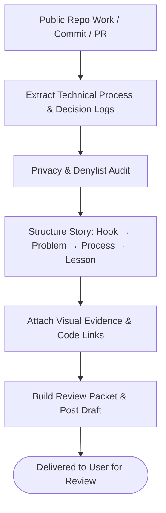

# linkedin-process-share

Creates an immutable, privacy-safe, review-only LinkedIn process-post packet from audited public project evidence.

## What it does

Turns public repository work into an evidence-backed LinkedIn draft with strict privacy boundaries. Verifies public provenance, extracts technical decisions and lessons learned, audits for PII/company secrets, and packages a structured review packet containing post copy, target audience, media links, and recruiter benefit notes. Never auto-publishes or alters LinkedIn profiles.

## Visual Pipeline



## Example

**You type:**
```
/linkedin-process-share
Create a LinkedIn post draft sharing our experience building the standalone FixBill PDF parser and bundling it into an agent skill.
```

**What happens:**

1. Runs the evidence gate to verify public commit SHA and files.
2. Audits draft for private paths, company names, or internal URLs.
3. Generates structured post draft:
   - **Hook**: How we reduced multi-line PDF address parsing overhead for Thai SME receipts.
   - **Problem**: PDF parser logic mangled Thai line breaks and font encodings when run headlessly.
   - **Solution**: Built a standalone Node.js PDF engine with fallback tsx resolution and bundled it directly with the Claude skill.
   - **Lesson**: Self-contained skills with embedded CLI tooling eliminate environment setup friction.
4. Outputs JSON review packet and formatted markdown draft for human review.

## Setup

Requires Python 3.8+ for running `build_review_packet.py` scripts.

## Install

```bash
cp -r linkedin-process-share ~/.claude/skills/
```
