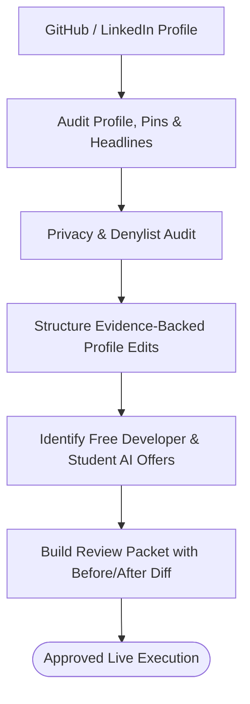

# professional-presence

Manages privacy-safe professional presence across LinkedIn, GitHub, and developer profiles.

## What it does

Audits and enhances professional profiles (LinkedIn headline, bio, experience, GitHub pins, READMEs), prepares evidence-backed post drafts, audits for sensitive PII/workplace data, and identifies legitimate free developer learning or AI student access opportunities. All live profile updates or form submissions require explicit human review and approval.

## Visual Workflow



## Example

**You type:**
```
/professional-presence
Audit my GitHub profile README and LinkedIn headline based on my latest public open-source skills repository.
```

**What happens:**

1. Inspects public profile repositories (`iampon-p/agent-action-skills`, `iampon-p/iampon-p`).
2. Audits for unredacted emails, phone numbers, or private paths.
3. Generates proposed headline and bio diffs:
   - **Current**: Full stack dev working on AI projects
   - **Proposed**: Autonomous AI Agent Engineer | Creator of `agent-action-skills` (14 open-source agent skills & bundled CLI engines)
4. Displays side-by-side review packet for approval before applying any profile update.

## Setup

No mandatory dependencies beyond standard browser or GitHub CLI setup.

## Install

```bash
cp -r professional-presence ~/.claude/skills/
```
