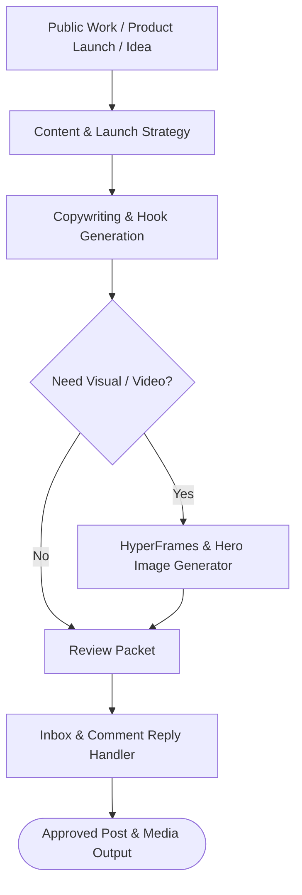

# social-update

Consolidated social content, personal branding, copywriting, and visual/video production engine.

## What it does

Orchestrates your entire social presence, content marketing, and creative production pipeline into a single unified skill. Integrates content strategy, copywriting, launch planning, inbox reply drafting, and motion graphics video generation (HyperFrames engine) with strict privacy boundaries.

## Visual Pipeline



## Features

- **Profile & Presence Management**: Audits headlines, bios, GitHub pins, and portfolio presentation.
- **Copywriting & Content Strategy**: Drafts engaging social posts, launch announcements, and Twitter/X threads.
- **Motion Graphics & Video**: Integrates HyperFrames CLI, GSAP animation rules, hero images, and media resolution.
- **Inbox & Reply Automation**: Classifies incoming messages and drafts privacy-safe responses.

## Setup

No mandatory dependencies beyond standard browser, GitHub CLI, or HyperFrames CLI (for video rendering).

## Install

```bash
cp -r social-update ~/.claude/skills/
```
